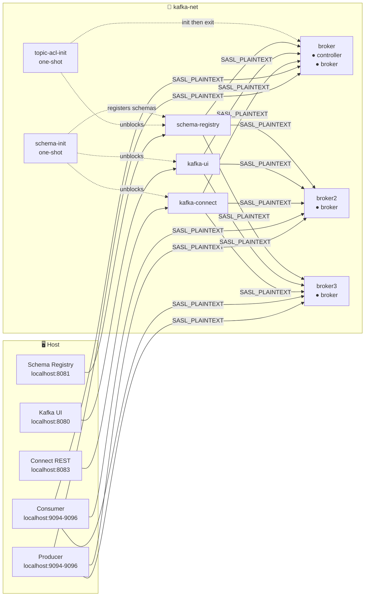
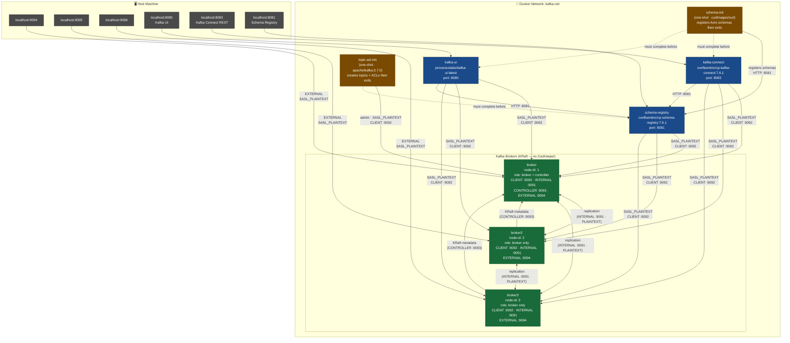

# apache-kafka-cluster

A production-inspired local Kafka cluster using **Apache Kafka 3.7 in KRaft mode** (no ZooKeeper).  
3 brokers, SASL/PLAIN authentication, StandardAuthorizer ACLs, Confluent Schema Registry, Kafka Connect, and Kafka UI — all in Docker Compose.

---

## Table of Contents

- [Architecture](#architecture)
- [Folder & File Structure](#folder--file-structure)
- [Services](#services)
- [Ports](#ports)
- [Credentials](#credentials)
- [Quick Start](#quick-start)
- [ACL Configuration](#acl-configuration)
- [Schema Registry](#schema-registry)
- [Producer & Consumer Examples](#producer--consumer-examples)
- [Administration](#administration)

---

## Architecture



<details>
<summary>e2e architecture</summary>



</details>

- **broker** is the sole KRaft **controller** (quorum voter). broker2 and broker3 are pure brokers.
- All inter-broker traffic uses the `INTERNAL` (PLAINTEXT) listener on port `9091`.
- All client traffic inside Docker uses the `CLIENT` (SASL_PLAINTEXT) listener on port `9092`.
- Host access uses the `EXTERNAL` (SASL_PLAINTEXT) listener mapped to `9094`, `9095`, `9096`.
- Schema Registry starts after `topic-acl-init` completes. `schema-init` then registers Avro schemas, and only after that do `kafka-connect` and `kafka-ui` start.

---

## Folder & File Structure

```
apache-kafka-cluster/
├── compose.yaml                  # Docker Compose stack definition
├── scripts/
│   ├── init.sh                   # One-shot topic creation + ACL setup script
│   └── schema-init.sh            # One-shot Avro schema registration script
└── secrets/
    ├── admin.properties          # Admin credentials for use INSIDE containers
    ├── host-admin.properties     # Admin credentials for use from the HOST machine
    ├── orders-producer.properties    # orders-producer client credentials
    ├── payments-consumer.properties  # payments-consumer client credentials
    ├── analytics-reader.properties   # analytics-reader client credentials (add user to JAAS first)
    └── kafka_server_jaas.conf    # JAAS config — broker-side user/password registry
```

### `compose.yaml`

Defines the full stack. Key design decisions:
- Uses a **YAML anchor** (`x-kafka-broker-common-env`) to share ~25 common env vars across all three brokers, avoiding repetition.
- `topic-acl-init` runs first and creates all topics + ACLs (including `_schemas`); `schema-registry` depends on it completing successfully.
- `schema-init` runs after `schema-registry` is healthy and registers all Avro schemas; `kafka-connect` and `kafka-ui` depend on it completing successfully.
- `version: "3.9"` with named volumes for persistent broker data.

### `scripts/init.sh`

Runs once at startup inside the `topic-acl-init` container. Responsibilities:
1. **Waits** for the broker to be reachable (polls `kafka-broker-api-versions.sh`).
2. **Creates topics** using `kafka-topics.sh` (idempotent — skips if already exists), including the Schema Registry backing topic `_schemas` (compacted, RF=3, single partition).
3. **Grants ACLs** using `kafka-acls.sh` for all service accounts.

Helper functions defined in the script:

| Function | Purpose |
|---|---|
| `create_topic <name> <partitions> <retention-ms> <cleanup-policy>` | Creates a topic with standard configs |
| `acl_topic <user> <topic> <op1> [op2...]` | Grants one or more operations on a topic |
| `acl_group <user> <group>` | Grants `Read + Describe` on a named consumer group, **locking** the user to only that group |

### `scripts/schema-init.sh`

Runs once at startup inside the `schema-init` container. Responsibilities:
1. **Waits** for Schema Registry to be reachable (polls `GET /subjects`).
2. **Registers Avro schemas** for every application topic (both `-key` and `-value` subjects) using `POST /subjects/<subject>/versions`.
3. Idempotent — re-registering an identical schema returns the existing schema ID.

Helper function defined in the script:

| Function | Purpose |
|---|---|
| `register_schema <subject> <schema-type> <schema-json>` | POSTs a schema to Schema Registry; succeeds on both `200` (new) and `409` (already exists) |

### `secrets/kafka_server_jaas.conf`

The broker-side JAAS configuration. All usernames and passwords for SASL/PLAIN are defined here. Any new service account must be added here **and** the broker restarted for it to authenticate.

```
KafkaServer {
  PlainLoginModule required
  username="admin"           ← broker-to-broker identity
  password="admin-secret"
  user_admin="admin-secret"
  user_connect-worker="connect-secret"
  user_kafka-ui="kafka-ui-secret"
  user_schema-registry="schema-registry-secret"
  user_orders-producer="orders-prod-secret"
  user_payments-consumer="payments-cons-secret";
};
```

### `secrets/admin.properties`

Used **inside Docker containers** (e.g. `topic-acl-init`, admin CLI tools exec'd into a broker).  
Points to `broker:9092` (internal Docker hostname).

```properties
bootstrap.servers=broker:9092
security.protocol=SASL_PLAINTEXT
sasl.mechanism=PLAIN
sasl.jaas.config=... username="admin" password="admin-secret" ...
```

### `secrets/host-admin.properties`

Used from your **Mac host** with CLI tools. Contains only SASL credentials — no `bootstrap.servers` (passed via `--bootstrap-server` flag instead).

```properties
security.protocol=SASL_PLAINTEXT
sasl.mechanism=PLAIN
sasl.jaas.config=... username="admin" password="admin-secret" ...
```

> **Important:** `admin` is a superuser and bypasses all ACLs. Use this file only for administration — never in application code.

---

## Services

### `broker` — KRaft Broker + Controller (node 1)

| Item | Value |
|---|---|
| Image | `apache/kafka:3.7.0` |
| Role | `broker,controller` |
| Node ID | `1` |
| Quorum voters | `1@broker:9093` (sole controller) |
| External port | `9094` (SASL_PLAINTEXT) |
| JMX port | `9999` |
| Volume | `broker-data` |

Listeners:

| Name | Port | Protocol | Used by |
|---|---|---|---|
| `INTERNAL` | `9091` | PLAINTEXT | Inter-broker replication |
| `CLIENT` | `9092` | SASL_PLAINTEXT | Docker services (connect, ui, init) |
| `CONTROLLER` | `9093` | PLAINTEXT | KRaft Raft consensus (internal only) |
| `EXTERNAL` | `9094` | SASL_PLAINTEXT | Host machine clients |

### `broker2` — KRaft Pure Broker (node 2)

| Item | Value |
|---|---|
| Role | `broker` only |
| Node ID | `2` |
| External port | `9095` |
| JMX port | `10000` |
| Volume | `broker2-data` |

### `broker3` — KRaft Pure Broker (node 3)

| Item | Value |
|---|---|
| Role | `broker` only |
| Node ID | `3` |
| External port | `9096` |
| JMX port | `10001` |
| Volume | `broker3-data` |

### `kafka-connect`

| Item | Value |
|---|---|
| Image | `confluentinc/cp-kafka-connect:7.6.1` |
| Port | `8083` (REST API) |
| Bootstrap | `broker:9092,broker2:9092,broker3:9092` |
| Auth user | `connect-worker` |
| Internal topics replication | `3` |
| Schema Registry URL | `http://schema-registry:8081` |
| Volume | `connect-plugins` (for connector JARs) |

Kafka Connect runs as user `connect-worker` and has ACLs to read/write application topics and manage its own internal `_connect-*` topics.

### `kafka-ui`

| Item | Value |
|---|---|
| Image | `provectuslabs/kafka-ui:latest` |
| Port | `8080` |
| Bootstrap | `broker:9092,broker2:9092,broker3:9092` |
| Auth user | `kafka-ui` |
| Schema Registry | `http://schema-registry:8081` |
| Default serde | `SchemaRegistry` (key + value) |
| Login | `admin` / `admin-secret` |
| URL | http://localhost:8080 |

Kafka UI runs as user `kafka-ui` which has `Describe + Read` on all topics (including `_schemas` and `_connect-*`) and `Describe + Read` on all consumer groups. It is connected to Schema Registry and automatically deserialises Avro messages in the message browser.

### `topic-acl-init`

| Item | Value |
|---|---|
| Image | `apache/kafka:3.7.0` |
| Type | One-shot (`restart: on-failure`) |
| Script | `scripts/init.sh` |
| Config | `secrets/admin.properties` |

Runs `init.sh` at startup. Creates all topics (including `_schemas`) and ACLs, then exits `0`. `schema-registry` waits for this to complete before starting.

### `schema-registry`

| Item | Value |
|---|---|
| Image | `confluentinc/cp-schema-registry:7.6.1` |
| Port | `8081` (HTTP REST API) |
| Bootstrap | `broker:9092,broker2:9092,broker3:9092` |
| Auth user | `schema-registry` |
| Backing topic | `_schemas` (compacted, RF=3) |
| Compatibility | `FULL_TRANSITIVE` |
| URL | http://localhost:8081 |

Stores all registered schemas in the `_schemas` Kafka topic. Kafka Connect and Kafka UI are both configured to use it for schema lookup.

### `schema-init`

| Item | Value |
|---|---|
| Image | `curlimages/curl:8.7.1` |
| Type | One-shot (`restart: on-failure`) |
| Script | `scripts/schema-init.sh` |

Runs after `schema-registry` is healthy. Registers Avro schemas for all application topics (`orders`, `payments`, `orders-events`, `payments-events`, `dead-letter`) — both `-key` and `-value` subjects. `kafka-connect` and `kafka-ui` wait for this to complete before starting.

---

## Ports

| Port (host) | Service | Listener | Protocol |
|---|---|---|---|
| `9094` | broker | EXTERNAL | SASL_PLAINTEXT |
| `9095` | broker2 | EXTERNAL | SASL_PLAINTEXT |
| `9096` | broker3 | EXTERNAL | SASL_PLAINTEXT |
| `9999` | broker | JMX | RMI |
| `10000` | broker2 | JMX | RMI |
| `10001` | broker3 | JMX | RMI |
| `8081` | schema-registry | REST | HTTP |
| `8083` | kafka-connect | REST | HTTP |
| `8080` | kafka-ui | Web | HTTP |

Bootstrap server addresses from the host:
```
localhost:9094,localhost:9095,localhost:9096
```
> A single address is sufficient — Kafka fetches broker metadata on first connect and discovers all nodes automatically.

---

## Credentials

| User | Password | Role |
|---|---|---|
| `admin` | `admin-secret` | **Superuser** — bypasses all ACLs |
| `connect-worker` | `connect-secret` | Kafka Connect internal user |
| `kafka-ui` | `kafka-ui-secret` | Kafka UI read/describe user |
| `schema-registry` | `schema-registry-secret` | Schema Registry Kafka store user |
| `orders-producer` | `orders-prod-secret` | Application producer |
| `payments-consumer` | `payments-cons-secret` | Application consumer |

---

## Quick Start

```bash
# Start the full stack
docker compose up -d

# Check all services are up
docker compose ps

# View init log (topic + ACL creation)
docker compose logs topic-acl-init

# View schema init log (Avro schema registration)
docker compose logs schema-init

# Open Kafka UI
open http://localhost:8080
# Login: admin / admin-secret

# Open Schema Registry (list registered subjects)
curl http://localhost:8081/subjects

# Tear down (including volumes)
docker compose down -v
```

---

## ACL Configuration

This cluster uses `StandardAuthorizer` with `KAFKA_ALLOW_EVERYONE_IF_NO_ACL_FOUND=false`, meaning **all access is denied by default** unless an explicit ACL grants it.

### Superusers

```
User:admin       ← bypasses all ACL checks
User:ANONYMOUS   ← required for KRaft controller-broker registration (CONTROLLER listener)
```

### ACL Model

Two grants are **always required** for a consumer to work:

1. `Read` + `Describe` on the **topic**
2. `Read` + `Describe` on the **consumer group**

If either is missing, the broker rejects the request. The group ACL acts as a **group name lock** — a user can only consume using the exact group name they have been granted.

### Defined ACLs

#### `connect-worker`

| Resource | Operations |
|---|---|
| Topic `_connect-*` (prefix) | Read, Write, Create, Describe, DescribeConfigs |
| Group `kafka-connect-cluster` | Read, Describe |
| Cluster | Describe, DescribeConfigs |
| Topic `orders`, `orders-events`, `payments-events`, `dead-letter` | Write, Create, Describe |
| Topic `orders`, `payments` | Read, Describe |
| Group `connect-*` (prefix) | Read |

#### `orders-producer`

| Resource | Operations |
|---|---|
| Topic `orders` | Write, Describe |
| Topic `dead-letter` | Write |

> No group ACL — this user **cannot consume** from any topic.

#### `payments-consumer`

| Resource | Operations |
|---|---|
| Topic `orders` | Read, Describe |
| Group `payments-cg` | Read, Describe |
| Topic `payments` | Write, Describe |
| Topic `dead-letter` | Write |

> Locked to consumer group `payments-cg` only. Any other group name → `GroupAuthorizationException`.

#### `analytics-reader`

| Resource | Operations |
|---|---|
| Topic `orders-events` | Read, Describe |
| Topic `payments-events` | Read, Describe |
| Group `analytics-cg` | Read, Describe |

> Locked to consumer group `analytics-cg` only.

#### `schema-registry`

| Resource | Operations |
|---|---|
| Topic `_schemas` | Read, Write, Create, Describe, DescribeConfigs |
| Cluster | Describe, DescribeConfigs |
| Group `schema-registry` | Read, Describe |

> The group ACL covers Schema Registry's internal leader-election (JoinGroup) protocol.

#### `kafka-ui`

| Resource | Operations |
|---|---|
| All app topics | Describe, Read |
| Topic `_connect-*` (prefix) | Describe, Read |
| Topic `_schemas` | Describe, Read |
| Group `*` (wildcard) | Describe, Read |

### Adding a New Service Account

1. Add the user to `secrets/kafka_server_jaas.conf`:
   ```
   user_my-service="my-secret"
   ```

2. Re-create the brokers (or restart them) to reload JAAS:
   ```bash
   docker compose restart broker broker2 broker3
   ```

3. Add ACLs in `scripts/init.sh` and re-run init:
   ```bash
   docker compose up topic-acl-init
   ```

---

## Schema Registry

Schema Registry is available at **http://localhost:8081** and stores schemas in the `_schemas` Kafka topic.

### Compatibility mode

All subjects default to `FULL_TRANSITIVE` — every new schema version must be forward- and backward-compatible with **all** previous versions, not just the latest.

### Registered subjects (bootstrapped by `schema-init`)

| Subject | Schema |
|---|---|
| `orders-key` | `{"type":"string"}` |
| `orders-value` | `{"type":"string"}` |
| `payments-key` | `{"type":"string"}` |
| `payments-value` | `{"type":"string"}` |
| `orders-events-key` | `{"type":"string"}` |
| `orders-events-value` | `{"type":"string"}` |
| `payments-events-key` | `{"type":"string"}` |
| `payments-events-value` | `{"type":"string"}` |
| `dead-letter-key` | `{"type":"string"}` |
| `dead-letter-value` | `{"type":"string"}` |

### REST API quick reference

```bash
# List all registered subjects
curl http://localhost:8081/subjects

# Get all versions of a subject
curl http://localhost:8081/subjects/orders-value/versions

# Fetch a specific version
curl http://localhost:8081/subjects/orders-value/versions/1

# Register a new Avro schema
curl -X POST http://localhost:8081/subjects/orders-value/versions \
  -H "Content-Type: application/vnd.schemaregistry.v1+json" \
  -d '{
    "schemaType": "AVRO",
    "schema": "{\"type\":\"record\",\"name\":\"Order\",\"fields\":[{\"name\":\"id\",\"type\":\"string\"},{\"name\":\"amount\",\"type\":\"double\"}]}"
  }'

# Check compatibility of a candidate schema before registering
curl -X POST http://localhost:8081/compatibility/subjects/orders-value/versions/latest \
  -H "Content-Type: application/vnd.schemaregistry.v1+json" \
  -d '{
    "schemaType": "AVRO",
    "schema": "{\"type\":\"record\",\"name\":\"Order\",\"fields\":[{\"name\":\"id\",\"type\":\"string\"},{\"name\":\"amount\",\"type\":\"double\"},{\"name\":\"currency\",\"type\":\"string\",\"default\":\"USD\"}]}"
  }'

# Get schema by global ID
curl http://localhost:8081/schemas/ids/1

# Check current global compatibility level
curl http://localhost:8081/config

# Override compatibility for a single subject
curl -X PUT http://localhost:8081/config/orders-value \
  -H "Content-Type: application/vnd.schemaregistry.v1+json" \
  -d '{"compatibility": "BACKWARD"}'

# Delete a subject (all versions) — soft delete
curl -X DELETE http://localhost:8081/subjects/orders-value

# View schema-init logs
docker compose logs schema-init
```

### Kafka Connect + Schema Registry

`kafka-connect` is pre-configured with the Schema Registry URL. To enable Avro serialisation for a connector, override the converter per-connector in the connector config:

```json
{
  "key.converter": "io.confluent.connect.avro.AvroConverter",
  "key.converter.schema.registry.url": "http://schema-registry:8081",
  "value.converter": "io.confluent.connect.avro.AvroConverter",
  "value.converter.schema.registry.url": "http://schema-registry:8081"
}
```

### Kafka UI + Schema Registry

Kafka UI is connected to Schema Registry (`KAFKA_CLUSTERS_0_SCHEMAREGISTRY`) with `SchemaRegistry` set as the default key and value serde. Messages in topics with registered schemas are automatically deserialized in the UI message browser.

---

## Producer & Consumer Examples

All commands below run from the `apache-kafka-cluster/` directory on your host.  
They use the **Confluent CLI** tools: `kafka-console-producer`, `kafka-console-consumer`, `kafka-avro-console-producer`, and `kafka-avro-console-consumer`.

> **Prerequisites — Install Confluent Platform CLI tools**  
> The Avro console tools (`kafka-avro-console-producer` / `kafka-avro-console-consumer`) are **not** included in the Apache Kafka distribution. Install Confluent Platform (Community Edition) from the zip/tar archive:
>
> 1. Download the archive from the [Confluent zip/tar installation page](https://docs.confluent.io/platform/current/installation/installing_cp/zip-tar.html#get-the-software).
> 2. Extract and add the `bin/` directory to your `PATH`:
>    ```bash
>    tar -xzf confluent-<version>.tar.gz
>    export PATH="$PWD/confluent-<version>/bin:$PATH"
>    ```
> 3. Verify:
>    ```bash
>    kafka-avro-console-producer --version
>    ```

> **SASL with Confluent CLI tools:** Always pass credentials via a **properties file** using `--producer.config` / `--consumer.config`.  
> Passing `sasl.jaas.config` inline via `--producer-property` / `--consumer-property` causes:
> ```
> SaslAuthenticationException: Failed to configure SaslClientAuthenticator
> UnsupportedOperationException: getSubject is not supported
> ```

The per-user properties files are committed under `secrets/` and ready to use:

| File | User | Password |
|---|---|---|
| `secrets/host-admin.properties` | `admin` | `admin-secret` |
| `secrets/orders-producer.properties` | `orders-producer` | `orders-prod-secret` |
| `secrets/payments-consumer.properties` | `payments-consumer` | `payments-cons-secret` |
| `secrets/analytics-reader.properties` | `analytics-reader` | `analytics-reader-secret` |

> **Note:** `analytics-reader` is not yet defined in `secrets/kafka_server_jaas.conf`. Add `user_analytics-reader="analytics-reader-secret"` there and restart the brokers before using `secrets/analytics-reader.properties`.

---

### Using `admin` (superuser — bypasses all ACLs)

`admin` is a superuser. Every produce and consume attempt succeeds regardless of topic or group name.

#### Plain string

```bash
# ✅ Produce — always allowed (superuser)
kafka-console-producer \
  --bootstrap-server localhost:9094 \
  --topic orders \
  --producer.config secrets/host-admin.properties

# ✅ Consume — always allowed (superuser)
kafka-console-consumer \
  --bootstrap-server localhost:9094 \
  --topic orders \
  --group any-group \
  --from-beginning \
  --consumer.config secrets/host-admin.properties
```

#### Avro (with Schema Registry)

```bash
# ✅ Produce Avro — superuser, schema registered/looked up via Schema Registry
kafka-avro-console-producer \
  --bootstrap-server localhost:9094 \
  --topic orders \
  --property schema.registry.url=http://localhost:8081 \
  --property value.schema='{"type":"record","name":"Order","fields":[{"name":"id","type":"string"},{"name":"amount","type":"double"}]}' \
  --producer.config secrets/host-admin.properties
# Input: {"id":"ord-1","amount":99.99}

# ✅ Consume Avro — schema ID in message wire format resolved from Schema Registry
kafka-avro-console-consumer \
  --bootstrap-server localhost:9094 \
  --topic orders \
  --group admin-cg \
  --from-beginning \
  --property schema.registry.url=http://localhost:8081 \
  --consumer.config secrets/host-admin.properties
```

---

### Using `orders-producer` (write-only, no consumer group ACL)

`orders-producer` has `Write + Describe` on `orders` and `dead-letter` only — no `Read` ACL and no group ACL.

#### Plain string

```bash
# ✅ Produce to `orders` — allowed (Write ACL)
kafka-console-producer \
  --bootstrap-server localhost:9094 \
  --topic orders \
  --producer.config secrets/orders-producer.properties

# ❌ Produce to `payments` — denied (no Write ACL on payments)
kafka-console-producer \
  --bootstrap-server localhost:9094 \
  --topic payments \
  --producer.config secrets/orders-producer.properties
# → TopicAuthorizationException

# ❌ Consume from `orders` — denied (no Read ACL, no group ACL)
kafka-console-consumer \
  --bootstrap-server localhost:9094 \
  --topic orders \
  --group any-group \
  --from-beginning \
  --consumer.config secrets/orders-producer.properties
# → TopicAuthorizationException
```

#### Avro (with Schema Registry)

```bash
# ✅ Produce Avro to `orders` — allowed
kafka-avro-console-producer \
  --bootstrap-server localhost:9094 \
  --topic orders \
  --property schema.registry.url=http://localhost:8081 \
  --property value.schema='{"type":"record","name":"Order","fields":[{"name":"id","type":"string"},{"name":"amount","type":"double"}]}' \
  --producer.config secrets/orders-producer.properties
# Input: {"id":"ord-1","amount":99.99}

# ❌ Consume Avro from `orders` — denied (no Read ACL, no group ACL)
kafka-avro-console-consumer \
  --bootstrap-server localhost:9094 \
  --topic orders \
  --group any-group \
  --from-beginning \
  --property schema.registry.url=http://localhost:8081 \
  --consumer.config secrets/orders-producer.properties
# → TopicAuthorizationException
```

---

### Using `payments-consumer` (group-locked consumer)

`payments-consumer` has `Read` on `orders`, `Write` on `payments` and `dead-letter`, and a **group lock** to `payments-cg` only.

#### Plain string

```bash
# ✅ Consume `orders` with CORRECT group `payments-cg` — allowed
kafka-console-consumer \
  --bootstrap-server localhost:9094 \
  --topic orders \
  --group payments-cg \
  --from-beginning \
  --consumer.config secrets/payments-consumer.properties

# ❌ Consume `orders` with WRONG group — denied (group ACL mismatch)
kafka-console-consumer \
  --bootstrap-server localhost:9094 \
  --topic orders \
  --group wrong-group \
  --from-beginning \
  --consumer.config secrets/payments-consumer.properties
# → GroupAuthorizationException

# ❌ Consume `payments` — denied (no Read ACL on payments for this user)
kafka-console-consumer \
  --bootstrap-server localhost:9094 \
  --topic payments \
  --group payments-cg \
  --from-beginning \
  --consumer.config secrets/payments-consumer.properties
# → TopicAuthorizationException

# ✅ Produce to `payments` — allowed (Write ACL)
kafka-console-producer \
  --bootstrap-server localhost:9094 \
  --topic payments \
  --producer.config secrets/payments-consumer.properties
```

#### Avro (with Schema Registry)

```bash
# ✅ Consume Avro from `orders` with CORRECT group — allowed, output decoded as JSON
kafka-avro-console-consumer \
  --bootstrap-server localhost:9094 \
  --topic orders \
  --group payments-cg \
  --from-beginning \
  --property schema.registry.url=http://localhost:8081 \
  --consumer.config secrets/payments-consumer.properties

# ❌ Consume Avro from `orders` with WRONG group — denied
kafka-avro-console-consumer \
  --bootstrap-server localhost:9094 \
  --topic orders \
  --group wrong-group \
  --from-beginning \
  --property schema.registry.url=http://localhost:8081 \
  --consumer.config secrets/payments-consumer.properties
# → GroupAuthorizationException
```

---

### Using `analytics-reader` (event consumer, group-locked)

`analytics-reader` has `Read` on `orders-events` and `payments-events`, locked to group `analytics-cg`.

#### Plain string

```bash
# ✅ Consume `orders-events` with CORRECT group — allowed
kafka-console-consumer \
  --bootstrap-server localhost:9094 \
  --topic orders-events \
  --group analytics-cg \
  --from-beginning \
  --consumer.config secrets/analytics-reader.properties

# ❌ Consume `orders-events` with WRONG group — denied
kafka-console-consumer \
  --bootstrap-server localhost:9094 \
  --topic orders-events \
  --group wrong-group \
  --from-beginning \
  --consumer.config secrets/analytics-reader.properties
# → GroupAuthorizationException

# ❌ Consume `orders` — denied (no Read ACL on orders for analytics-reader)
kafka-console-consumer \
  --bootstrap-server localhost:9094 \
  --topic orders \
  --group analytics-cg \
  --from-beginning \
  --consumer.config secrets/analytics-reader.properties
# → TopicAuthorizationException
```

#### Avro (with Schema Registry)

```bash
# ✅ Consume Avro from `orders-events` with CORRECT group — allowed
kafka-avro-console-consumer \
  --bootstrap-server localhost:9094 \
  --topic orders-events \
  --group analytics-cg \
  --from-beginning \
  --property schema.registry.url=http://localhost:8081 \
  --consumer.config secrets/analytics-reader.properties

# ❌ Consume Avro from `payments-events` with WRONG group — denied
kafka-avro-console-consumer \
  --bootstrap-server localhost:9094 \
  --topic payments-events \
  --group wrong-group \
  --from-beginning \
  --property schema.registry.url=http://localhost:8081 \
  --consumer.config secrets/analytics-reader.properties
# → GroupAuthorizationException
```

---

## Administration

### List topics
```bash
kafka-topics.sh \
  --bootstrap-server localhost:9094 \
  --list \
  --command-config secrets/host-admin.properties
```

### Describe a topic
```bash
kafka-topics.sh \
  --bootstrap-server localhost:9094 \
  --describe --topic orders \
  --command-config secrets/host-admin.properties
```

### List all ACLs
```bash
kafka-acls.sh \
  --bootstrap-server localhost:9094 \
  --list \
  --command-config secrets/host-admin.properties
```

### List consumer groups
```bash
kafka-consumer-groups.sh \
  --bootstrap-server localhost:9094 \
  --list \
  --command-config secrets/host-admin.properties
```

### Describe consumer group offsets
```bash
kafka-consumer-groups.sh \
  --bootstrap-server localhost:9094 \
  --describe --group payments-cg \
  --command-config secrets/host-admin.properties
```

### Re-run topic/ACL init (without full restart)
```bash
docker compose up topic-acl-init
```

### Re-run schema init (re-register all Avro schemas)
```bash
docker compose up schema-init
```

### Inspect Schema Registry from the host

```bash
# List all subjects
curl http://localhost:8081/subjects

# List versions of a subject
curl http://localhost:8081/subjects/orders-value/versions

# Fetch latest schema for a subject
curl http://localhost:8081/subjects/orders-value/versions/latest

# Check global compatibility mode
curl http://localhost:8081/config
```
