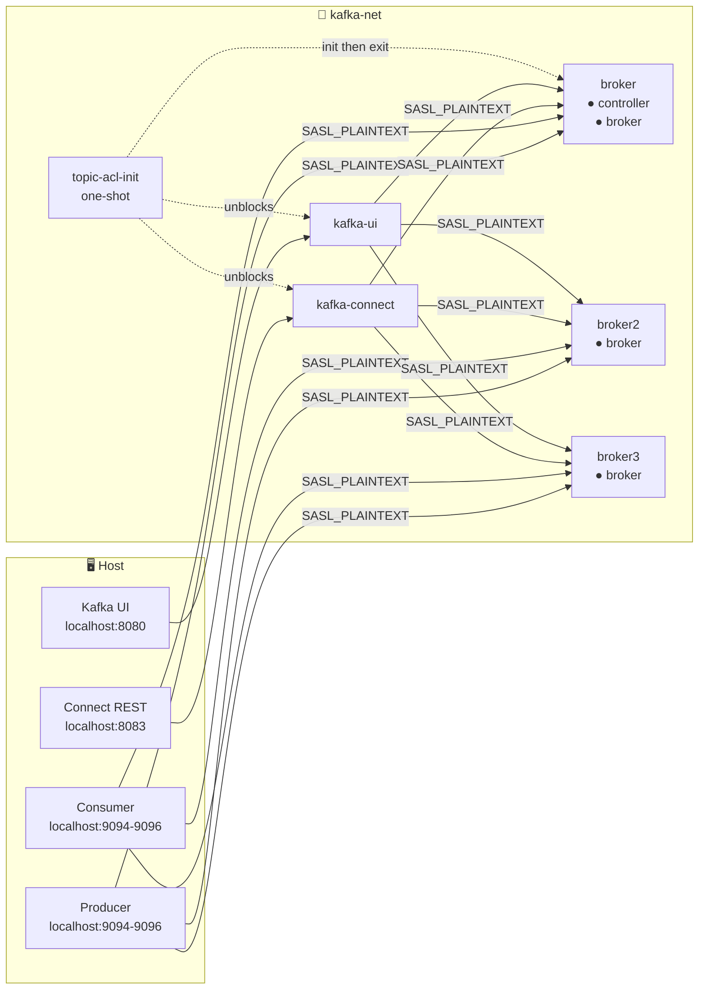
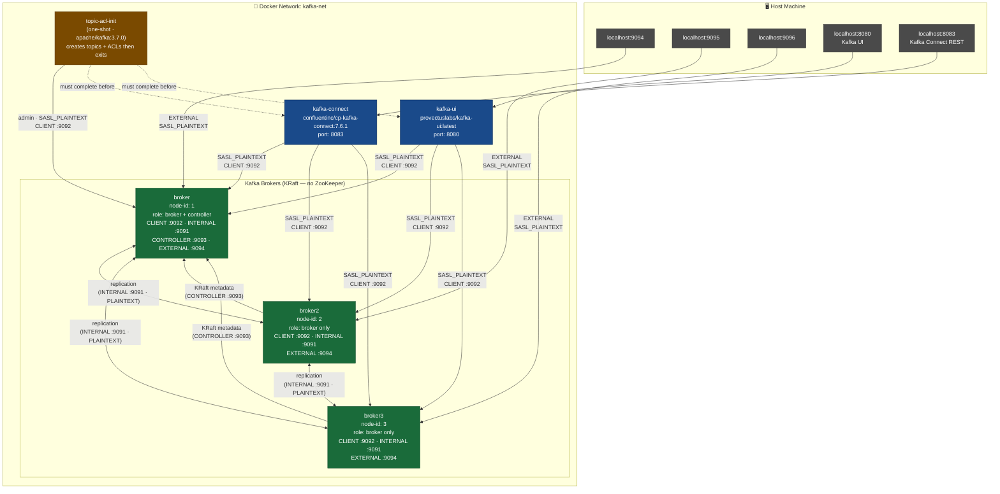

# apache-kafka-cluster

A production-inspired local Kafka cluster using **Apache Kafka 3.7 in KRaft mode** (no ZooKeeper).  
3 brokers, SASL/PLAIN authentication, StandardAuthorizer ACLs, Kafka Connect, and Kafka UI — all in Docker Compose.

---

## Table of Contents

- [Architecture](#architecture)
- [Folder & File Structure](#folder--file-structure)
- [Services](#services)
- [Ports](#ports)
- [Credentials](#credentials)
- [Quick Start](#quick-start)
- [ACL Configuration](#acl-configuration)
- [Producer & Consumer Examples](#producer--consumer-examples)
- [Administration](#administration)

---

## Architecture



<details>
<summary>e2e architecture</summary>



</details>

- **broker** is the sole KRaft **controller** (quorum voter). broker2 and broker3 are pure brokers.
- All inter-broker traffic uses the `INTERNAL` (PLAINTEXT) listener on port `9091`.
- All client traffic inside Docker uses the `CLIENT` (SASL_PLAINTEXT) listener on port `9092`.
- Host access uses the `EXTERNAL` (SASL_PLAINTEXT) listener mapped to `9094`, `9095`, `9096`.

---

## Folder & File Structure

```
apache-kafka-cluster/
├── compose.yaml                  # Docker Compose stack definition
├── scripts/
│   └── init.sh                   # One-shot topic creation + ACL setup script
└── secrets/
    ├── admin.properties          # Admin credentials for use INSIDE containers
    ├── host-admin.properties     # Admin credentials for use from the HOST machine
    └── kafka_server_jaas.conf    # JAAS config — broker-side user/password registry
```

### `compose.yaml`

Defines the full stack. Key design decisions:
- Uses a **YAML anchor** (`x-kafka-broker-common-env`) to share ~25 common env vars across all three brokers, avoiding repetition.
- `topic-acl-init` runs first and creates all topics + ACLs; `kafka-connect` and `kafka-ui` depend on it completing successfully.
- `version: "3.9"` with named volumes for persistent broker data.

### `scripts/init.sh`

Runs once at startup inside the `topic-acl-init` container. Responsibilities:
1. **Waits** for the broker to be reachable (polls `kafka-broker-api-versions.sh`).
2. **Creates topics** using `kafka-topics.sh` (idempotent — skips if already exists).
3. **Grants ACLs** using `kafka-acls.sh` for all service accounts.

Helper functions defined in the script:

| Function | Purpose |
|---|---|
| `create_topic <name> <partitions> <retention-ms> <cleanup-policy>` | Creates a topic with standard configs |
| `acl_topic <user> <topic> <op1> [op2...]` | Grants one or more operations on a topic |
| `acl_group <user> <group>` | Grants `Read + Describe` on a named consumer group, **locking** the user to only that group |

### `secrets/kafka_server_jaas.conf`

The broker-side JAAS configuration. All usernames and passwords for SASL/PLAIN are defined here. Any new service account must be added here **and** the broker restarted for it to authenticate.

```
KafkaServer {
  PlainLoginModule required
  username="admin"           ← broker-to-broker identity
  password="admin-secret"
  user_admin="admin-secret"
  user_connect-worker="connect-secret"
  user_kafka-ui="kafka-ui-secret"
  user_orders-producer="orders-prod-secret"
  user_payments-consumer="payments-cons-secret";
};
```

### `secrets/admin.properties`

Used **inside Docker containers** (e.g. `topic-acl-init`, admin CLI tools exec'd into a broker).  
Points to `broker:9092` (internal Docker hostname).

```properties
bootstrap.servers=broker:9092
security.protocol=SASL_PLAINTEXT
sasl.mechanism=PLAIN
sasl.jaas.config=... username="admin" password="admin-secret" ...
```

### `secrets/host-admin.properties`

Used from your **Mac host** with CLI tools. Contains only SASL credentials — no `bootstrap.servers` (passed via `--bootstrap-server` flag instead).

```properties
security.protocol=SASL_PLAINTEXT
sasl.mechanism=PLAIN
sasl.jaas.config=... username="admin" password="admin-secret" ...
```

> **Important:** `admin` is a superuser and bypasses all ACLs. Use this file only for administration — never in application code.

---

## Services

### `broker` — KRaft Broker + Controller (node 1)

| Item | Value |
|---|---|
| Image | `apache/kafka:3.7.0` |
| Role | `broker,controller` |
| Node ID | `1` |
| Quorum voters | `1@broker:9093` (sole controller) |
| External port | `9094` (SASL_PLAINTEXT) |
| JMX port | `9999` |
| Volume | `broker-data` |

Listeners:

| Name | Port | Protocol | Used by |
|---|---|---|---|
| `INTERNAL` | `9091` | PLAINTEXT | Inter-broker replication |
| `CLIENT` | `9092` | SASL_PLAINTEXT | Docker services (connect, ui, init) |
| `CONTROLLER` | `9093` | PLAINTEXT | KRaft Raft consensus (internal only) |
| `EXTERNAL` | `9094` | SASL_PLAINTEXT | Host machine clients |

### `broker2` — KRaft Pure Broker (node 2)

| Item | Value |
|---|---|
| Role | `broker` only |
| Node ID | `2` |
| External port | `9095` |
| JMX port | `10000` |
| Volume | `broker2-data` |

### `broker3` — KRaft Pure Broker (node 3)

| Item | Value |
|---|---|
| Role | `broker` only |
| Node ID | `3` |
| External port | `9096` |
| JMX port | `10001` |
| Volume | `broker3-data` |

### `kafka-connect`

| Item | Value |
|---|---|
| Image | `confluentinc/cp-kafka-connect:7.6.1` |
| Port | `8083` (REST API) |
| Bootstrap | `broker:9092,broker2:9092,broker3:9092` |
| Auth user | `connect-worker` |
| Internal topics replication | `3` |
| Volume | `connect-plugins` (for connector JARs) |

Kafka Connect runs as user `connect-worker` and has ACLs to read/write application topics and manage its own internal `_connect-*` topics.

### `kafka-ui`

| Item | Value |
|---|---|
| Image | `provectuslabs/kafka-ui:latest` |
| Port | `8080` |
| Bootstrap | `broker:9092,broker2:9092,broker3:9092` |
| Auth user | `kafka-ui` |
| Login | `admin` / `admin-secret` |
| URL | http://localhost:8080 |

Kafka UI runs as user `kafka-ui` which has `Describe + Read` on all topics and `Describe + Read` on all consumer groups (required to browse messages).

### `topic-acl-init`

| Item | Value |
|---|---|
| Image | `apache/kafka:3.7.0` |
| Type | One-shot (`restart: on-failure`) |
| Script | `scripts/init.sh` |
| Config | `secrets/admin.properties` |

Runs `init.sh` at startup. Creates all topics and ACLs, then exits `0`. `kafka-connect` and `kafka-ui` wait for this to complete before starting.

---

## Ports

| Port (host) | Service | Listener | Protocol |
|---|---|---|---|
| `9094` | broker | EXTERNAL | SASL_PLAINTEXT |
| `9095` | broker2 | EXTERNAL | SASL_PLAINTEXT |
| `9096` | broker3 | EXTERNAL | SASL_PLAINTEXT |
| `9999` | broker | JMX | RMI |
| `10000` | broker2 | JMX | RMI |
| `10001` | broker3 | JMX | RMI |
| `8083` | kafka-connect | REST | HTTP |
| `8080` | kafka-ui | Web | HTTP |

Bootstrap server addresses from the host:
```
localhost:9094,localhost:9095,localhost:9096
```
> A single address is sufficient — Kafka fetches broker metadata on first connect and discovers all nodes automatically.

---

## Credentials

| User | Password | Role |
|---|---|---|
| `admin` | `admin-secret` | **Superuser** — bypasses all ACLs |
| `connect-worker` | `connect-secret` | Kafka Connect internal user |
| `kafka-ui` | `kafka-ui-secret` | Kafka UI read/describe user |
| `orders-producer` | `orders-prod-secret` | Application producer |
| `payments-consumer` | `payments-cons-secret` | Application consumer |

---

## Quick Start

```bash
# Start the full stack
docker compose up -d

# Check all services are up
docker compose ps

# View init log (topic + ACL creation)
docker compose logs topic-acl-init

# Open Kafka UI
open http://localhost:8080
# Login: admin / admin-secret

# Tear down (including volumes)
docker compose down -v
```

---

## ACL Configuration

This cluster uses `StandardAuthorizer` with `KAFKA_ALLOW_EVERYONE_IF_NO_ACL_FOUND=false`, meaning **all access is denied by default** unless an explicit ACL grants it.

### Superusers

```
User:admin       ← bypasses all ACL checks
User:ANONYMOUS   ← required for KRaft controller-broker registration (CONTROLLER listener)
```

### ACL Model

Two grants are **always required** for a consumer to work:

1. `Read` + `Describe` on the **topic**
2. `Read` + `Describe` on the **consumer group**

If either is missing, the broker rejects the request. The group ACL acts as a **group name lock** — a user can only consume using the exact group name they have been granted.

### Defined ACLs

#### `connect-worker`

| Resource | Operations |
|---|---|
| Topic `_connect-*` (prefix) | Read, Write, Create, Describe, DescribeConfigs |
| Group `kafka-connect-cluster` | Read, Describe |
| Cluster | Describe, DescribeConfigs |
| Topic `orders`, `orders-events`, `payments-events`, `dead-letter` | Write, Create, Describe |
| Topic `orders`, `payments` | Read, Describe |
| Group `connect-*` (prefix) | Read |

#### `orders-producer`

| Resource | Operations |
|---|---|
| Topic `orders` | Write, Describe |
| Topic `dead-letter` | Write |

> No group ACL — this user **cannot consume** from any topic.

#### `payments-consumer`

| Resource | Operations |
|---|---|
| Topic `orders` | Read, Describe |
| Group `payments-cg` | Read, Describe |
| Topic `payments` | Write, Describe |
| Topic `dead-letter` | Write |

> Locked to consumer group `payments-cg` only. Any other group name → `GroupAuthorizationException`.

#### `analytics-reader`

| Resource | Operations |
|---|---|
| Topic `orders-events` | Read, Describe |
| Topic `payments-events` | Read, Describe |
| Group `analytics-cg` | Read, Describe |

> Locked to consumer group `analytics-cg` only.

#### `kafka-ui`

| Resource | Operations |
|---|---|
| All app topics | Describe, Read |
| Topic `_connect-*` (prefix) | Describe, Read |
| Group `*` (wildcard) | Describe, Read |

### Adding a New Service Account

1. Add the user to `secrets/kafka_server_jaas.conf`:
   ```
   user_my-service="my-secret"
   ```

2. Re-create the brokers (or restart them) to reload JAAS:
   ```bash
   docker compose restart broker broker2 broker3
   ```

3. Add ACLs in `scripts/init.sh` and re-run init:
   ```bash
   docker compose up topic-acl-init
   ```

---

## Producer & Consumer Examples

All commands below run from the `apache-kafka-cluster/` directory on your Mac host.

### Using `admin` (superuser — bypasses ACLs)

```bash
# Produce
kafka-console-producer.sh \
  --bootstrap-server localhost:9094 \
  --topic orders \
  --producer.config secrets/host-admin.properties

# Consume
kafka-console-consumer.sh \
  --bootstrap-server localhost:9094 \
  --topic orders \
  --from-beginning \
  --consumer.config secrets/host-admin.properties
```

### Using `orders-producer` (write-only)

```bash
# Produce — allowed
kafka-console-producer.sh \
  --bootstrap-server localhost:9094 \
  --topic orders \
  --producer-property security.protocol=SASL_PLAINTEXT \
  --producer-property sasl.mechanism=PLAIN \
  --producer-property 'sasl.jaas.config=org.apache.kafka.common.security.plain.PlainLoginModule required username="orders-producer" password="orders-prod-secret";'

# Consume — denied (no topic Read ACL, no group ACL)
kafka-console-consumer.sh \
  --bootstrap-server localhost:9094 \
  --topic orders \
  --group any-group \
  --consumer-property security.protocol=SASL_PLAINTEXT \
  --consumer-property sasl.mechanism=PLAIN \
  --consumer-property 'sasl.jaas.config=org.apache.kafka.common.security.plain.PlainLoginModule required username="orders-producer" password="orders-prod-secret";'
# → TopicAuthorizationException
```

### Using `payments-consumer` (group-locked consumer)

```bash
# Consume with CORRECT group — allowed
kafka-console-consumer.sh \
  --bootstrap-server localhost:9094 \
  --topic orders \
  --group payments-cg \
  --from-beginning \
  --consumer-property security.protocol=SASL_PLAINTEXT \
  --consumer-property sasl.mechanism=PLAIN \
  --consumer-property 'sasl.jaas.config=org.apache.kafka.common.security.plain.PlainLoginModule required username="payments-consumer" password="payments-cons-secret";'

# Consume with WRONG group — denied
kafka-console-consumer.sh \
  --bootstrap-server localhost:9094 \
  --topic orders \
  --group wrong-group \
  --from-beginning \
  --consumer-property security.protocol=SASL_PLAINTEXT \
  --consumer-property sasl.mechanism=PLAIN \
  --consumer-property 'sasl.jaas.config=org.apache.kafka.common.security.plain.PlainLoginModule required username="payments-consumer" password="payments-cons-secret";'
# → GroupAuthorizationException
```

### Using `analytics-reader`

```bash
kafka-console-consumer.sh \
  --bootstrap-server localhost:9094 \
  --topic orders-events \
  --group analytics-cg \
  --from-beginning \
  --consumer-property security.protocol=SASL_PLAINTEXT \
  --consumer-property sasl.mechanism=PLAIN \
  --consumer-property 'sasl.jaas.config=org.apache.kafka.common.security.plain.PlainLoginModule required username="analytics-reader" password="<analytics-reader-secret>";'
```

> `analytics-reader` has no password in `kafka_server_jaas.conf` yet — add `user_analytics-reader="<password>"` there first.

### Using a properties file (cleaner alternative)

Create a file e.g. `secrets/orders-producer.properties`:
```properties
security.protocol=SASL_PLAINTEXT
sasl.mechanism=PLAIN
sasl.jaas.config=org.apache.kafka.common.security.plain.PlainLoginModule required username="orders-producer" password="orders-prod-secret";
```

Then:
```bash
kafka-console-producer.sh \
  --bootstrap-server localhost:9094 \
  --topic orders \
  --producer.config secrets/orders-producer.properties
```

---

## Administration

### List topics
```bash
kafka-topics.sh \
  --bootstrap-server localhost:9094 \
  --list \
  --command-config secrets/host-admin.properties
```

### Describe a topic
```bash
kafka-topics.sh \
  --bootstrap-server localhost:9094 \
  --describe --topic orders \
  --command-config secrets/host-admin.properties
```

### List all ACLs
```bash
kafka-acls.sh \
  --bootstrap-server localhost:9094 \
  --list \
  --command-config secrets/host-admin.properties
```

### List consumer groups
```bash
kafka-consumer-groups.sh \
  --bootstrap-server localhost:9094 \
  --list \
  --command-config secrets/host-admin.properties
```

### Describe consumer group offsets
```bash
kafka-consumer-groups.sh \
  --bootstrap-server localhost:9094 \
  --describe --group payments-cg \
  --command-config secrets/host-admin.properties
```

### Re-run topic/ACL init (without full restart)
```bash
docker compose up topic-acl-init
```
